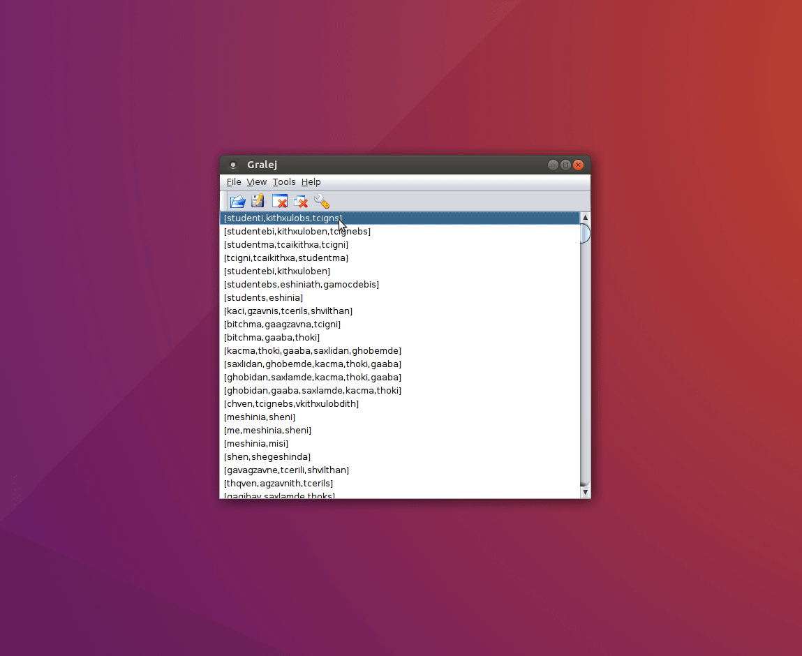
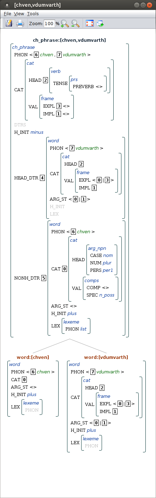
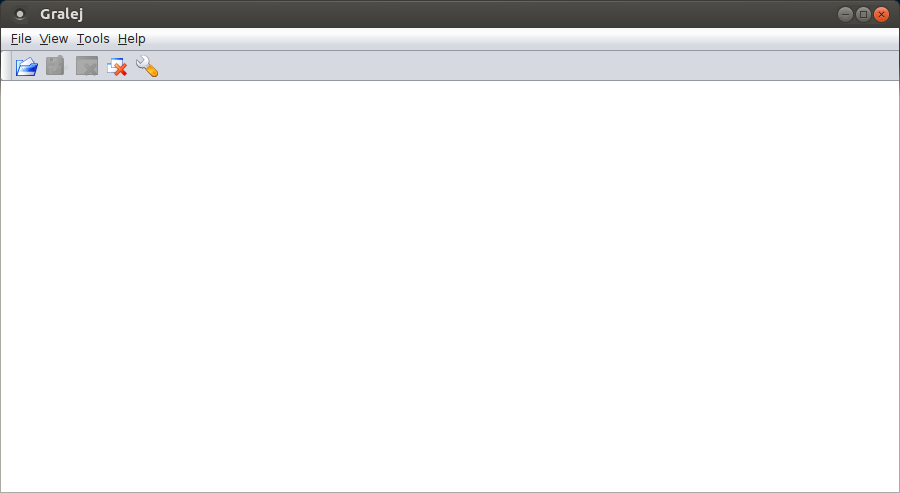
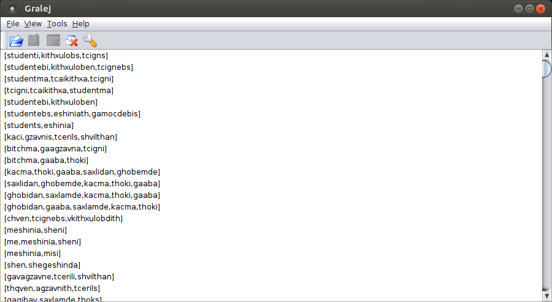
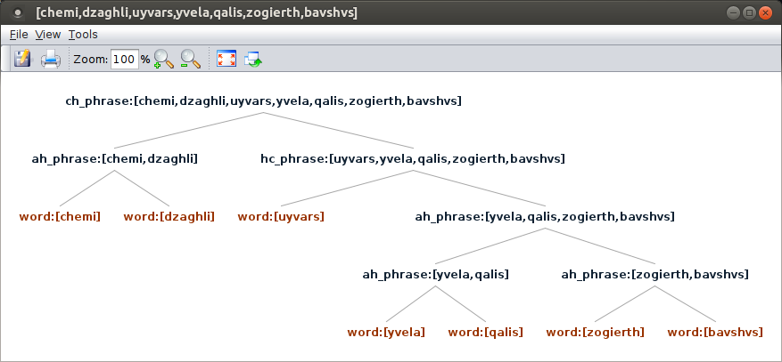
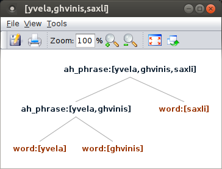
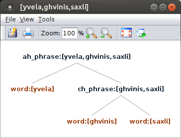

# GeoGram
An HPSG-based Formal Grammar of a Core Fragment of Georgian Implemented in TRALE.

This is a part of an [MSc thesis](docs/Thesis%20-%20HPSG%20for%20Georgian.pdf).
The presentation slides of the thesis are [here](docs/GeoGram-presentation.pdf).
An animated visualization of the sampel parse with the [`Gralej`](https://code.google.com/archive/p/gralej/) graphical interface:

 

___
### Table of content
* [Georgram versions](#versions)
* [TRALE installation](#installation)
* [Running the GeoGram grammar](#running)
  * [Run TRALE](#run_trale)
  * [Compile the grammar](#compile)
  * [Test on the test suite & explore parses](#test)
  * [Parse a custom input](#parse_1)
  * [Prasing ambiguity](#parse_2)
* [Reference](#reference)

___
# GeoGram versions <a name="versions"/>
GeoGram is presented as six nested grammars -- starting from the initial grammar `gr1` and ending with the final grammar `gr6`. The next version adds new components to the previous version.
Such organization is mainly motivated for teaching purposes. 

Short descriptions and relations between these versions of GeoGram:
* `gr1`: covers the verb complementation by nouns.
* `gr2`: `gr1` + verb complementation by nouns and pronouns, distinction between explicit and implicit arguments modeling the polypersonal agreement and pro-drop properties.
* `gr3`: `gr2` + adjunction of the noun by quantifiers and adjectives.
* `gr4`: `gr3` + adjunction of the noun by noun and pronoun possessives.
* `gr5`: `gr4` + noun complementation by possessive phrases
* `gr6`: `gr5` + nominalized quantifiers and adjectives, lexical rules for nominals - argument declension, adjunct declension, adjunct nominalization, pluralization and possessivization; and lexical rules for verbal conjugation - conjugation paradigm I, conjugation paradigm II and conjugation paradigm III.

**Use the last version if you are only interested in the most complete version of GeoGram.**


# TRALE installation <a name="installation"/>
Before you run the grammar, you need to install TRALE.
TRALE is a system for parsing, logic programming and constraint resolution with typed feature structures in a manner roughly consistent with their use in Head-driven Phrase Structure Grammar (HPSG).

There are several ways to install TRALE depending on your machine and availability of a SICStus Prolog:
* [TRALE download page](http://milca.sfs.uni-tuebingen.de/A4/Course/trale/) - this is considered as an official page, where you can find the lattes version of TRALE (at the time of writing this, it needs a Sicstus Prolog installation). This is the most comprehensive but arguably the least easy way of installing TRALE.
* [Grammix](https://hpsg.hu-berlin.de/Software/Grammix/) - a bootable CD Rom that contains TRALE along with some sample grammars (e.g., it can be run on windows OS via Virtual Machines). This installation can be suitable for teaching.
* [Standalone TRALE](https://hpsg.hu-berlin.de/Software/Trale/) - a version that does not need commercial Sicstus Prolog but does need Linux OS. This version of TRALE was used during the development of GeoGram.

More details about the installation (and running grammars) can be found in [this comprehensive instructions](http://utkl.ff.cuni.cz/%7Erosen/public/trale.pdf) by Alexandr Rosen (copy of it is also located in `docs/`). 


# Running the GeoGram grammar <a name="running"/>

These commands are tested on the standalone TRALE.

Go to the directory where `theory.pl` of the grammar you want to run is located <a name="run_trale"/> 
and execute TRALE with `s`hell mode, `g`raphical interface, and from stabnd`a`lone executable. 
```
$ cd GeoGram/gr6
$ trale -sag
Using Trale system found in $TRALE_PATH 
Starting Trale (no saved state) from sources and the gralej interface
   Starting gralej interface . started on 5001 of host localhost
   Starting standalone version of Trale (standalone-trale.Linux)
Loading Interface connection specifications (options -g):

Establishing connection to interface on port 5001 of localhost.
Connection established.


TRALE Milca environment (version 2.7.12)
Copyright (C) 2002/3 Project MILCA A4
PIs: Detmar Meurers (OSU), Gerald Penn (Univ. Toronto), Frank Richter (Univ. T�bingen)
All rights reserved

 ! ?-
```

For the meaning of flags, run `trale -h`.
Running TRALE with graphical interface, you should see an additional window. In the screenshot `Gralej` is used for graphical interface:



___
Compile the grammar: <a name="compile"/>

```
 ! ?- c.
Reading signature file...
signature
Compiling type unification...
{ALE: Warning: unary branch from arg_npn to arg_noun}
{ALE: Warning: assuming the following types are maximally specific: abl1 abl2 adj_ adj_i adj_lex adv ah_phrase arg_noun attrib ben both cat ch_phrase cnst com comps conj1 conj2 conj3 dat dat_c decl_a decl_e decl_i decl_ou dynamic e_lex e_list erg erg_c frame fut gen hc_phrase ine ins loc minus n_poss na ne_list nom nom_c noun_lex ori per1 per2 per3 plur plus pn_poss pnp_q poss_noun poss_pn prs psc pst qnt_ qnt_i qnt_lex quant sing static stative ter unspec verb verb_lex verb_val word }
Compiling appropriateness...
{ALE: Warning: homomorphism condition fails for case in adjunct and noun}
{ALE: Warning: homomorphism condition fails for case in noun and adjunct}
{ALE: Warning: homomorphism condition fails for case in noun and poss_npn}
{ALE: Warning: homomorphism condition fails for case in poss_npn and noun}
Compiling extensionality declarations...
Compiling subtype covering constraints...
Compiling functional and macro descriptions...
Compiling type constraints...
Compiling most general satisfiers...
Compiling type promotion...
Compiling feature selection...
Compiling unification...
Compiling definite clauses...
Compiling lexical rules...
Compiling lexicon...
Compiling empty categories and phrase structure rules...

yes
```

___
Run the grammar on the test suite. It should pass all the tests (more than 1,000 tests). <a name="test"/> 
```
 ! ?- test(all).
 (1)    studenti kithxulobs tcigns  % The student reads the book
 ==>    0.010 sec CPU time.        1 solutions (ok); 6 passive edges; residues: 0

 (2)    studentebi kithxuloben tcignebs  % students reads books
 ==>    0.010 sec CPU time.        1 solutions (ok); 6 passive edges; residues: 0
  .
  .
  .
 (1393) chven vdumvarth  
 ==>    0.000 sec CPU time.        1 solutions (ok); 5 passive edges; residues: 5

 (1394) enatrebodath patara lamazi dzaghli  
 ==>    0.000 sec CPU time.        1 solutions (ok); 12 passive edges; residues: 5

yes
```

The screenshot shows all parsed phrases from the test suite, where you can select any phrase from the list and explore it:




___
Parse a custom phrase. <a name="parse_1"/>
Note that the `lexicon.pl` should cover the vocabulary of the phrase, otherwise parsing will fail.
In the example, the grammar parses `my dog likes each woman's some kid`.
There is only one parse of the sentence found.

```
 ! ?- rec[chemi,dzaghli,uyvars,yvela,qalis,zogierth,bavshvs].

STRING: 
0 chemi 1 dzaghli 2 uyvars 3 yvela 4 qalis 5 zogierth 6 bavshvs 7

Do you want to try for more solutions? (return for <yes>) yes


no
```

This is the screenshot of the full parse tree:



___
Now let's see an example of a phrase that has more than one parse. <a name="parse_2"/>
Parse `all wine's house`:

```
 ! ?- rec[yvela,ghvinis,saxli].

STRING: 
0 yvela 1 ghvinis 2 saxli 3

Do you want to try for more solutions? (return for <yes>) yes


Do you want to try for more solutions? (return for <yes>) yes


no
```

Two parses of the phrase are `(all wine)'s house` meaning *house of all wine* and `all (wine's house)` meaning *all wine houses*:





# Reference <a name="reference"/>

If you use GeoGram, cite the following work:

```
@MastersThesis{Abzianidze:thesis:2011,
    author  = "Abzianidze, Lasha",
    title   = "An {HPSG}-based Formal Grammar of a Core Fragment of {Georgian} Implemented in {TRALE}",
    school  = "{C}harles {U}niversity in {P}rague",
    address = "the {C}zech {R}epublic",
    year    = 2011
    }
```
 
